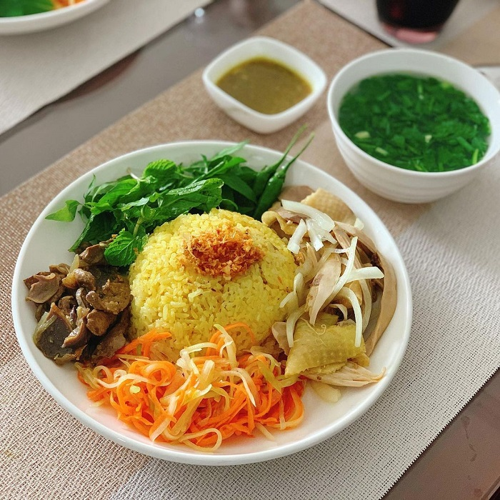
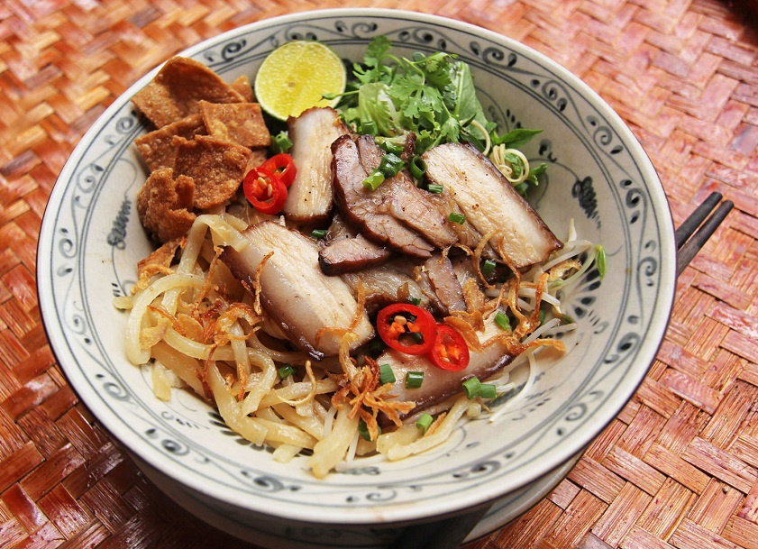

## HoiAn

### Food:
- **Bánh mì `(bread)`**
> 

- **Cơm gà `(chicken rice)`**
> 

- **Cao lầu `(Hoi An noodles)`**
> 

- **Bánh hoa hồng trắng `(white rose)`**
> 

- **Bánh bèo chén `(water fern cake in a small bowl)`**
> 

- **Bánh ướt thịt nướng `(steamed thin rice pancake and grilled pork)`**
> 

- **Tào phớ `(tofu pudding)`**
> 

- **Chí mà phù (chè mè đen) `(a kind of sweet soup)`**
> 

### Places:
- **Khu phố cổ `(old town)`**
> 

## DaNang
