## [HoiAn]

### Foods:
- **`Some outstanding foods`**

	|||
	| ---- | ----------------- |
	|**[Bánh mì /bun mee/](./foods/hoian/banhmi.md) `(bread)`**||
	|**[Cơm gà /gum gah/](./foods/hoian/comga.md) `(chicken rice)`**||
	|**[Cao lầu /cow low/](./foods/hoian/caolau.md) `(a pork noodle dish)`**||
	|**[Bánh hoa hồng trắng /bun hwa hawng trang/](./foods/hoian/banhhoahongtrang.md) `(white rose)`**||
	|**[Bánh bèo chén /bun bey-oh chen/](./foods/hoian/banhbeochen.md) `(water fern cake in a small bowl)`**||
	|**[Bánh ướt thịt nướng /bun uwt teet noong/](./foods/hoian/banhuotthitnuong.md) `(steamed thin rice pancake and grilled pork)`**||
	|**[Bún thịt nướng /boon teet noong/](./foods/hoian/bunthitnuong.md) `(grilled pork on skewers with noodles)`**||
	|**[Bánh xèo /bun say-oh/](./foods/hoian/banhxeo.md) `(crispy Vietnam pancake)`**||
	|**[Mì hoành thánh (vằn thắn) /mee hwan tahn/](./foods/hoian/mihoanhthanh.md) `(wonton soup)`**||
	|**[Bánh tôm /bun tom/](./foods/hoian/banhtom.md) `(shrimp in batter)`**||
	|**[Bánh ghẹ /bun ghe/](./foods/hoian/banhghe.md) `(fried crab cake)`**||
	|**[Bò Nướng Lá Lót /boh noo-uhng lah loht/]() `(grilled beef wrapped in betel leaf)`**|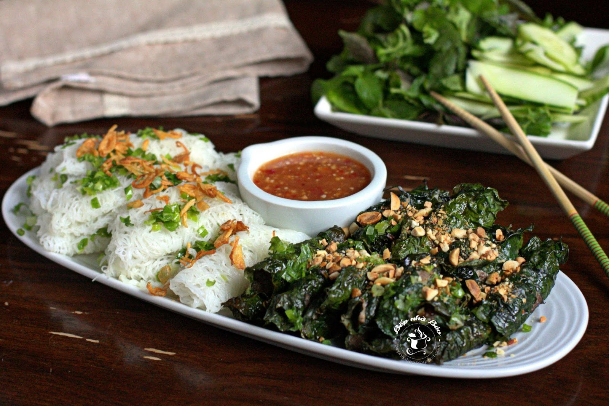|
	|**[Xiên Nướng /see-en noo-uhng/]() `(grilled skewers)`**|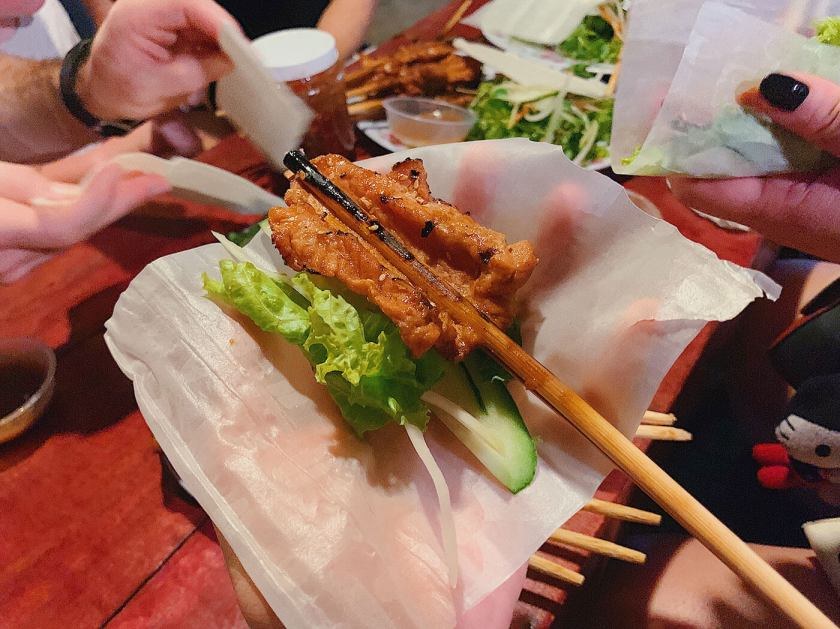|
	|**[Bánh Đập /bun dap/]() `(crushed rice cracker)`**|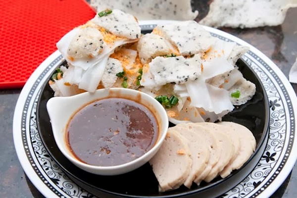|
	|**[Hến Trộn /hen trawn/]() `(stir-fried baby clams mixed with various vegetables, herbs, and spices)`**|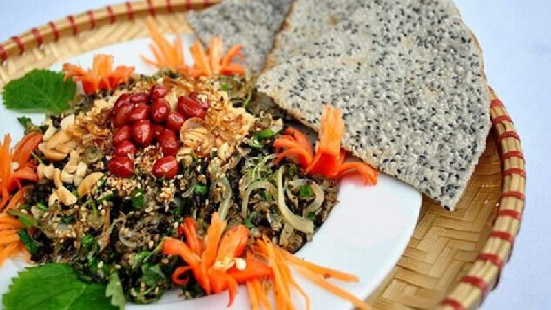|
	|**[Cà ri bò kho /ka-ree boh khaw/](./foods/hoian/caribokho.md) `(curry beef stew)`**|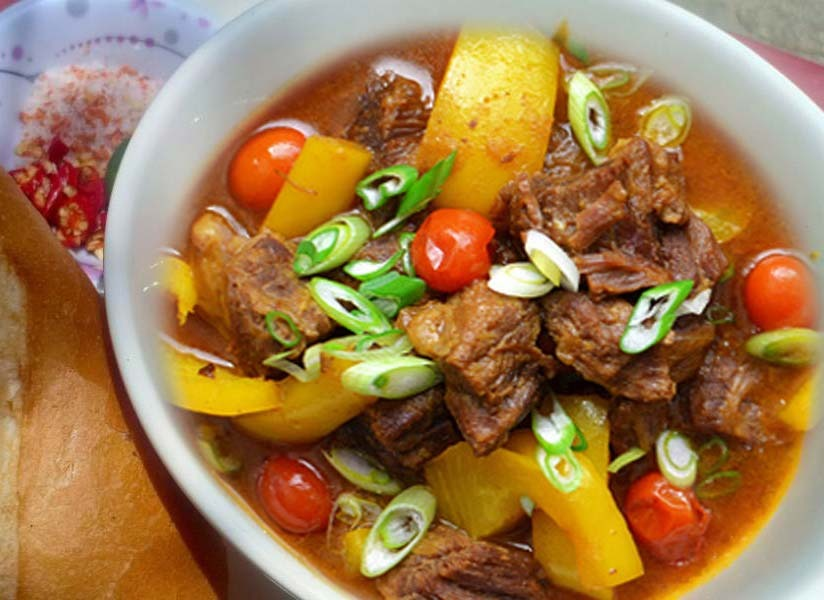|
	|**[Mỳ Quảng /mee kwang/](./foods/hoian/miquang.md) `(Quang noddle)`**|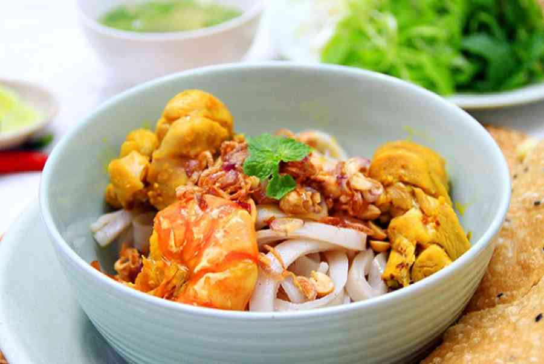|

### Drinks:
- **`Some outstanding drinks`**

	|||
	| ---- | ----------------- |
	|**[Nước Mót /noo-uhk moht/]() `(Mot’s traditional herbal drink)`**|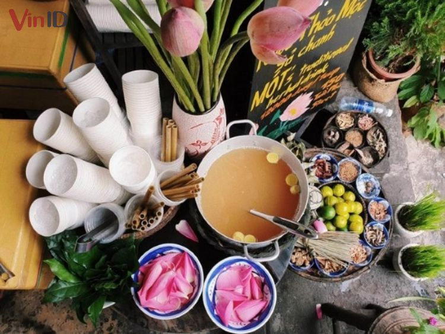|
	|**[Chè đậu đỏ /cheh dow doh/](./foods/hoian/chedaudo.md) `(red bean sweet soup)`**||
	|**[Chè bắp /cheh bup/](./foods/hoian/chebap.md) `(sweet corn porridge)`**||
	|**[Chí mà phù (chè mè đen) /cheh meh den/](./foods/hoian/chimaphu.md) `(a kind of sweet soup)`**||
	|**[Tào phớ /tao fuh/](./foods/hoian/taopho.md) `(tofu pudding)`**||

### Places:
- **`Khu phố cổ (old town)`**

	|||
	| ---- | ----------------- |
	| **Chùa Cầu `(Cau pagoda)`** ||
	| **Chùa Phúc Kiến `(Phuc Kien pagoda)`** |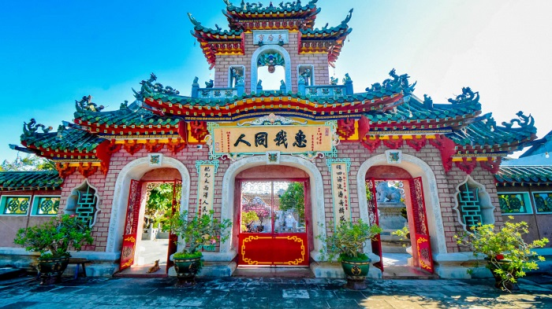|
	| **Chợ Hội An `(Hoi An market)`** ||
	|**Chợ đêm `(Night market)`**|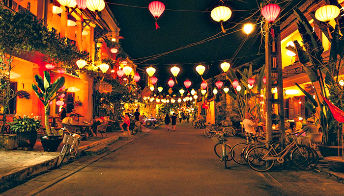|
	|**Các khu di tích `(monuments)`**||

- **`Other most wanted places`**

	|||
	| ---- | ----------------- |
	|**Làng gốm Thanh Hà `(Thanh Ha pottery village)`**||
	|**Làng rau Trà Quế `(Tra Que vegetable village)`**||
	|**Rừng dừa Bảy Mẫu `(Bay Mau coconut forest)`**||
	|**Biển An Bàng `(An Bang beach)`**|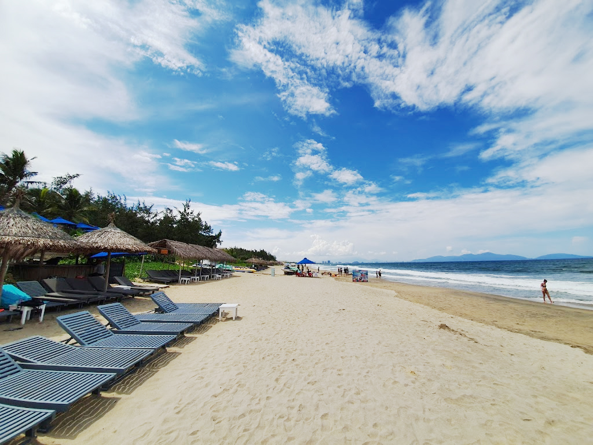|
	|**Biển Cửa Đại `(Cua Dai beach)`**| 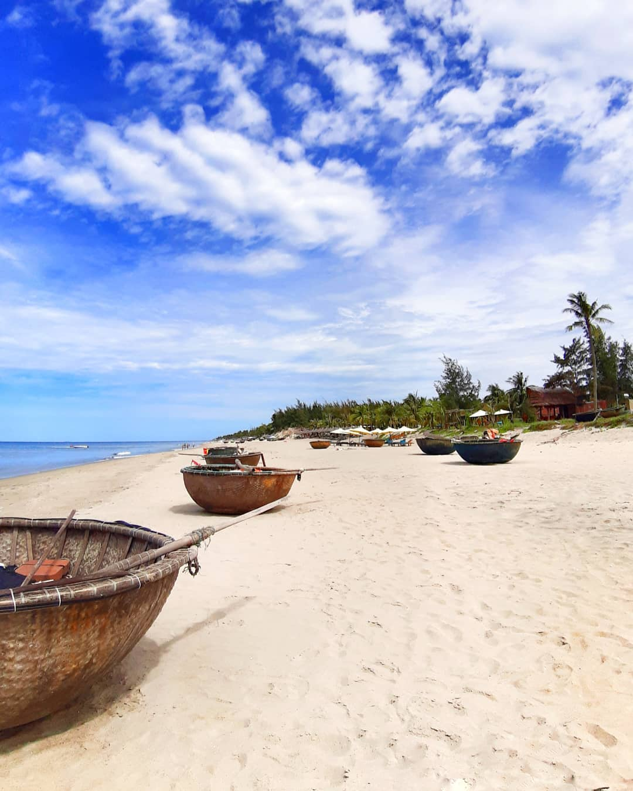|
	|**Cù lao Chàm `(Cham islands)`**|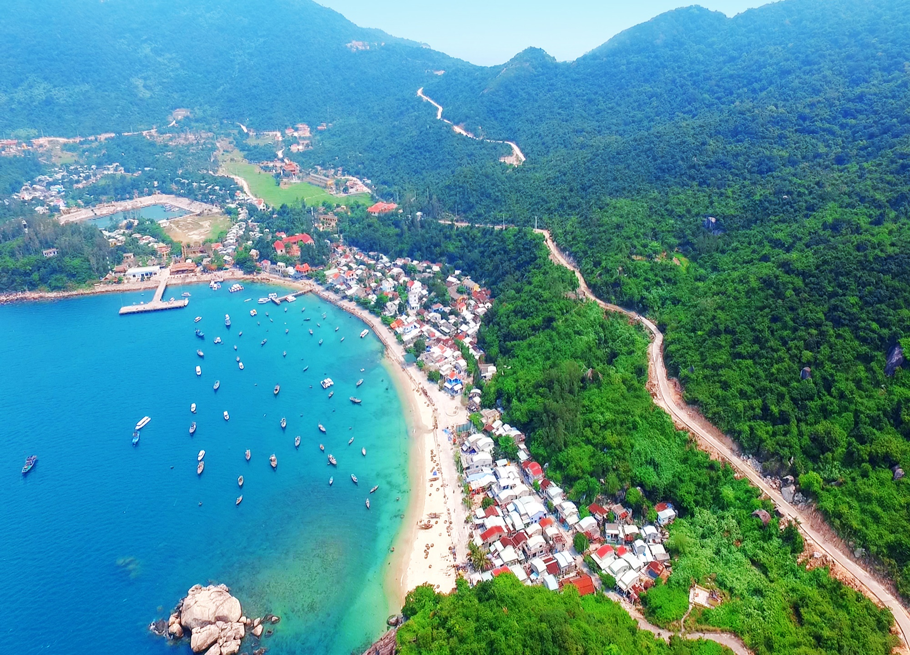|
	|**Vinpearl**|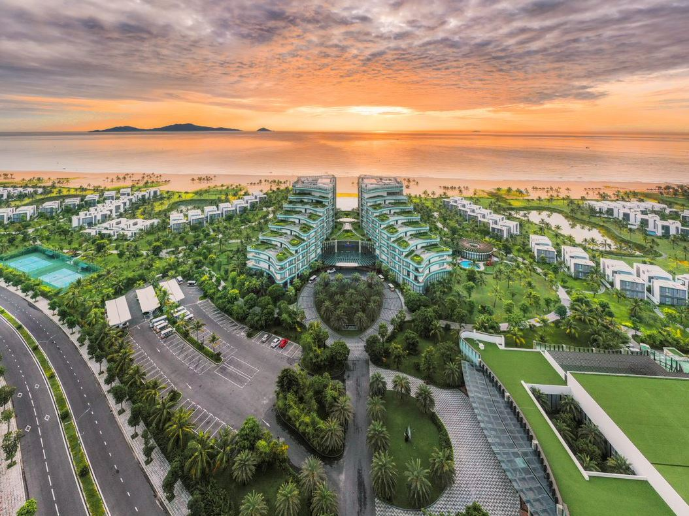|
	|**Show ký ức Hội An `(Hoi An memories)`**|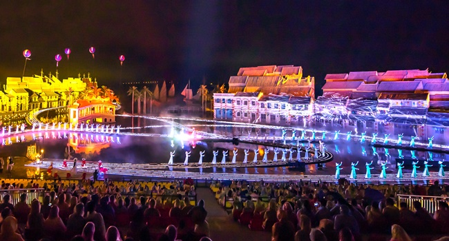|

## [DaNang]

### Foods:
- **`Some outstanding foods`**

	|||
	| ---- | ----------------- |
	|**Bánh tráng kẹp /bun trang kehp/ `(rice paper sandwich)`**||
	|**Bánh nậm /bun nam/ `(flat steamed rice dumplings)`**||
	|**Bánh bột lọc /bun bot lohk/ `(rice dumplings cake)`**||
	|**Bánh căn /bun cahn/ `(Vietnamese mini pancake)`**||
	|**Bánh đập /bun dap/ `(crushed rice cracker)`**||
	|**[Bún mắm nêm /boon mam nem/](./foods/danang/bunmamnem.md) `(rice vermicelli with smelly fish sauce)`**||
	|**Bún chả cá /boon cha ka/ `(fish cake noodle)`**||
	|**Bún hải sản /boon hai san/ `(seafood noodle)`**||
	|**Cơm hến /gum hen/ `(baby basket clams rice)`**||
	|**Nem tré /nem treh/ `(fried fermented pork roll)`**||
	|**Phá lấu /fah low/ `(organ meat)`**||
	|**Ram cuốn lá cải /ram kwoon lah kai/ `(fried spring roll in cabbage)`**||
	|**Cháo quẩy sườn sụn /chow kwai soong soon/ `(rice porridge with deep-fried dough sticks and pork ribs)`**||

### Drinks:
- **`Some outstanding drinks`**

	|||
	| ---- | ----------------- |
	|**Kem bơ /kem bo/ `(avocado ice cream)`**||
	|**Chè sầu riêng /cheh sow ree-eng/ `(durian sweet soup)`**||

### Places:
- **`most wanted places`**

	|||
	| ---- | ----------------- |
	|**Bà Nà Hills `(Ba Na Hills)`**||
	|**Thánh địa Mỹ Sơn `(My Son Sanctuary)`**||
	|**Ngũ Hành Sơn `(Marble Mountains)`**||
	|**Cầu rồng `(The Dragon bridge)`**||
	|**Đèo Hải Vân `(Hai Van Pass)`**||
	|**Làng cổ Phong Nam `(Phong Nam ancient village)`**||
	|**Cầu sông Hàn `(Han river bridge)`**||
	|**Cầu khoá tình yêu `(love lock bridge)`**||
	|**Đỉnh bàn cờ `(Ban Co peak)`**||
	|**Chùa Linh Ứng `(Linh Ung pagoda)`**||
