## [HoiAn]

### Food:
- **[Bánh mì](./foods/hoian/banhmi.md) `(bread)`**
> 

- **[Cơm gà](./foods/hoian/comga.md) `(chicken rice)`**
> 

- **[Cao lầu](./foods/hoian/caolau.md) `(Hoi An noodles)`**
> 

- **[Bánh hoa hồng trắng](./foods/hoian/banhhoahongtrang.md) `(white rose)`**
> 

- **[Bánh bèo chén](./foods/hoian/banhbeochen.md) `(water fern cake in a small bowl)`**
> 

- **[Bánh ướt thịt nướng](./foods/hoian/banhuotthitnuong.md) `(steamed thin rice pancake and grilled pork)`**
> 

- **[Bún thịt nướng](./foods/hoian/bunthitnuong.md) `(Grilled pork and rice vermicelli)`**
> 

- **[Bánh xèo](./foods/hoian/banhxeo.md) `(sizzling crepes)`**
> 

- **[Mì hoành thánh (vằn thắn)](./foods/hoian/mihoanhthanh.md) `(wonton soup)`**
> 

- **[Bánh tôm](./foods/hoian/banhtom.md) `(shrimp in batter)`**
> 

- **[Bánh ghẹ](./foods/hoian/banhghe.md) `(fried crab cake)`**
> 

- **[Tào phớ](./foods/hoian/taopho.md) `(tofu pudding)`**
> 

- **[Chí mà phù (chè mè đen)](./foods/hoian/chimaphu.md) `(a kind of sweet soup)`**
> 

- **[Chè bắp](./foods/hoian/chebap.md) `(sweet corn porridge)`**
> 

- **[Chè đậu đỏ](./foods/hoian/chedaudo.md) `(red bean sweet soup)`**
> 

### Places:
- **Khu phố cổ `(old town)`**
> 

- **Chùa Cầu `(Cau pagoda)`**
> 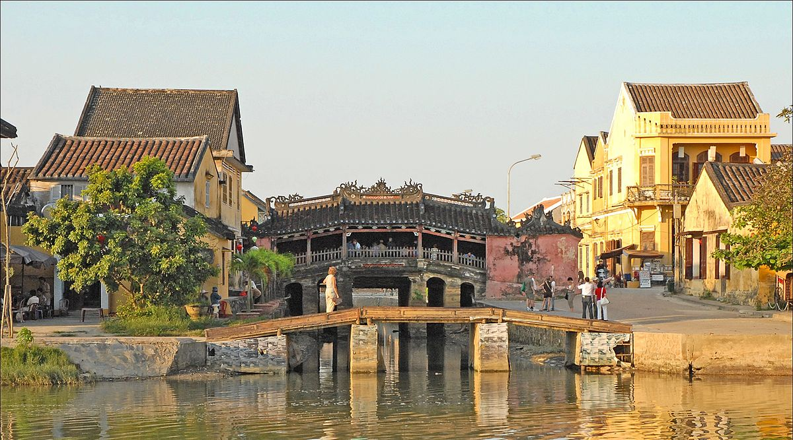

- **Chợ Hội An `(Hoi An market)`**
> 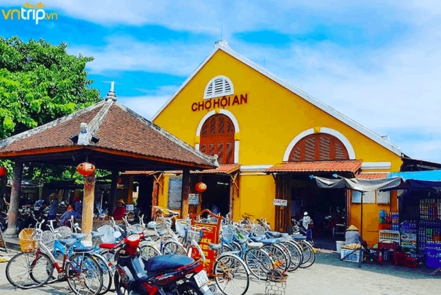

- **Làng gốm Thanh Hà `(Thanh Ha pottery village)`**
> 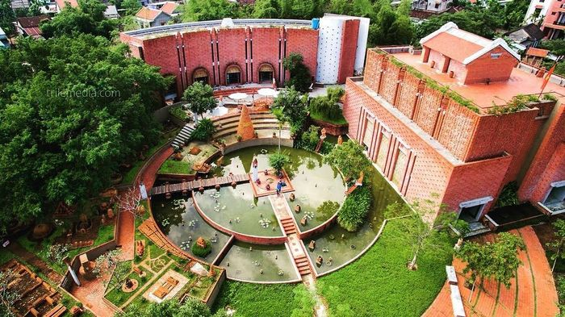

- **Làng rau Trà Quế `(Tra Que vegetable village)`**
> 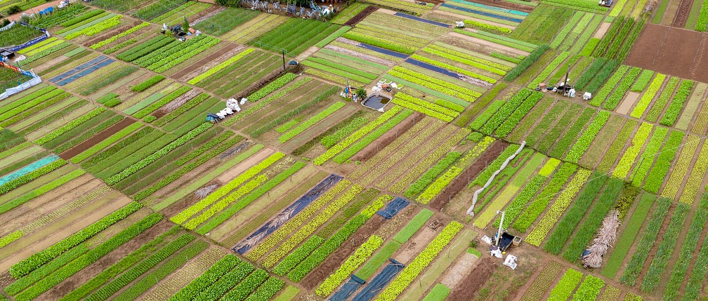

- **Rừng dừa Bảy Mẫu `(Bay Mau coconut forest)`**
> 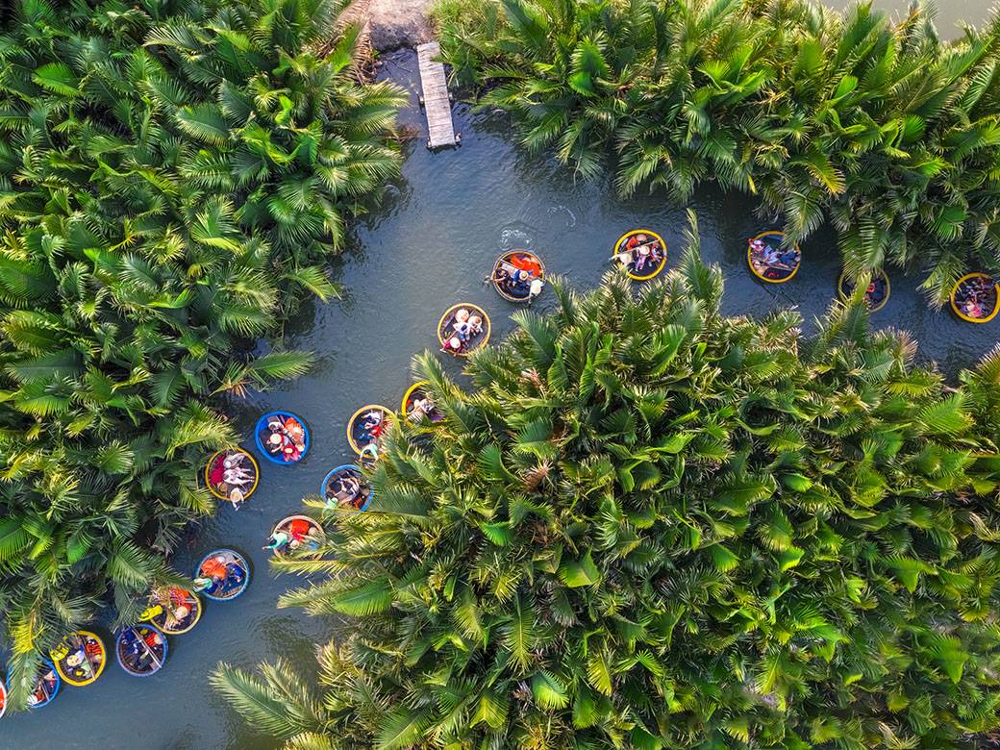

## [DaNang]

### Food:
- **Bánh tráng kẹp `(rice paper sandwich)`**
> 

- **Bánh nậm `(flat steamed rice dumplings)`**
> 

- **Bánh bột lọc `(rice dumpling cake)`**
> 

- **Bánh căn `(Vietnamese mini pancake)`**
> 

- **Bánh đập `(crushed rice cracker)`**
> 

- **Bún mắm nêm `(rice vermicelli with smelly fish sauce)`**
> 

- **Bún chả cá `(fish cake noodle)`**
> 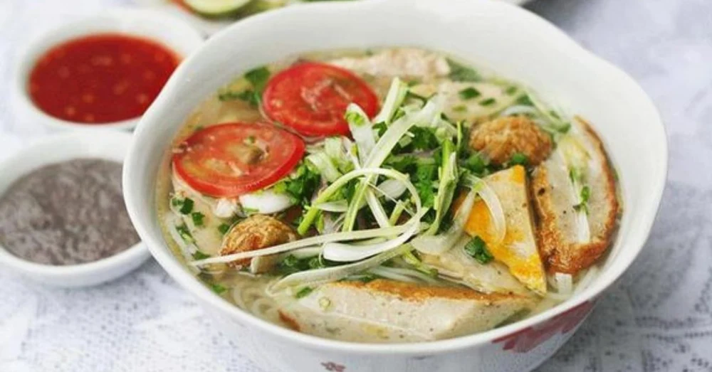

- **Bún hải sản `(seafood noodle)`**
> 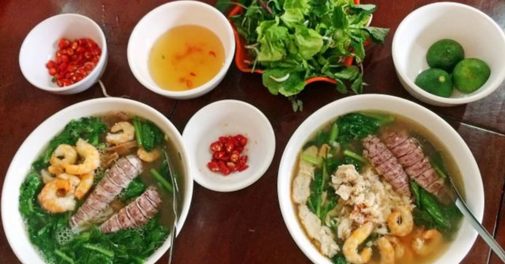

- **Cơm hến `(baby basket clams rice)`**
> 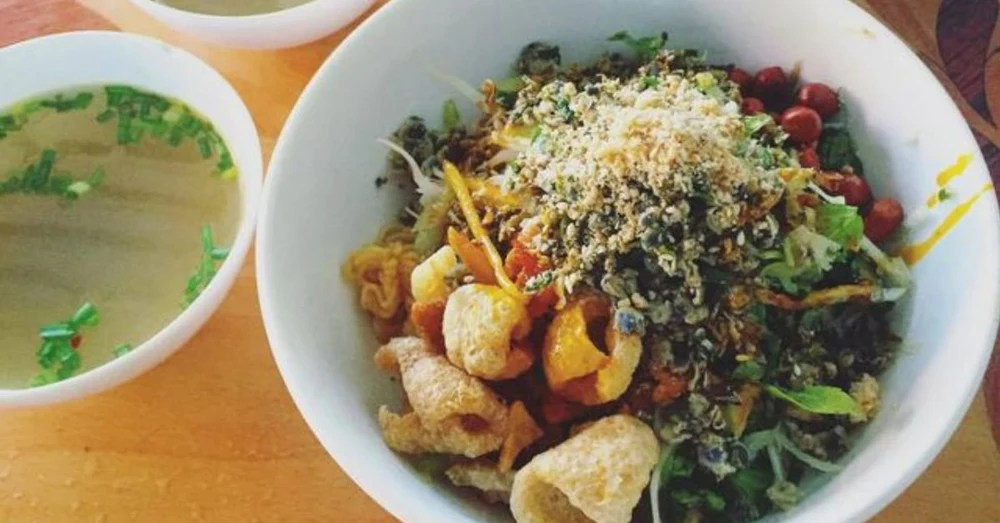

- **Nem tré `(fried fermented pork roll)`**
> 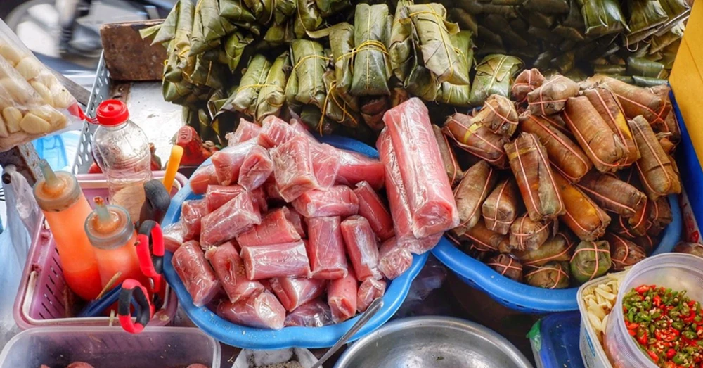

- **Phá lấu `(beef offal)`**
> 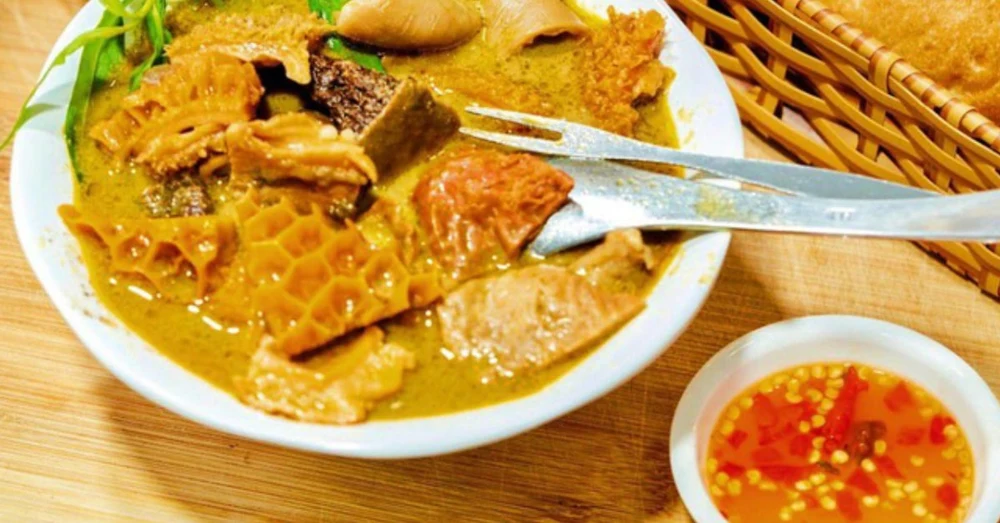

- **Ram cuốn lá cải `(fried spring roll in cabbage)`**
> 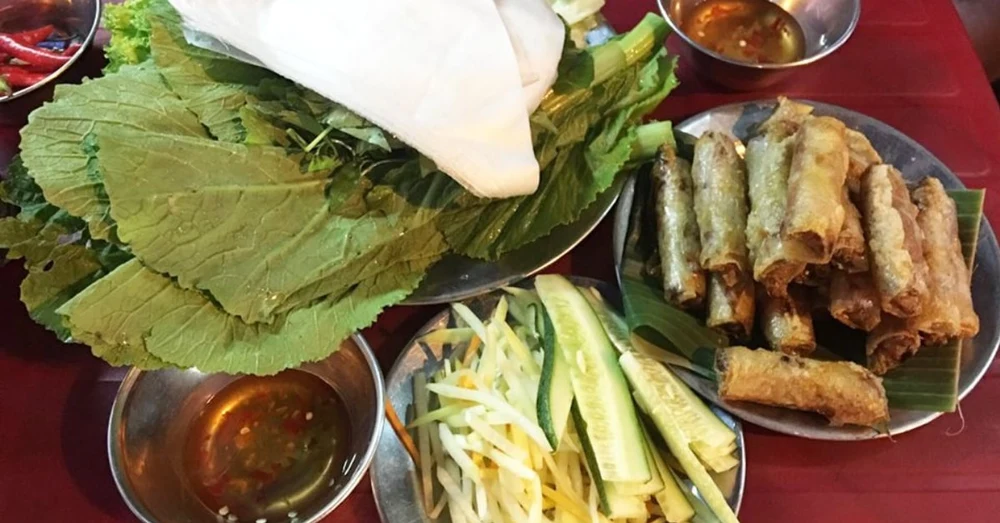

- **Cháo quẩy sườn sụn `(rice porridge with deep-fried dough sticks and pork ribs)`**
> 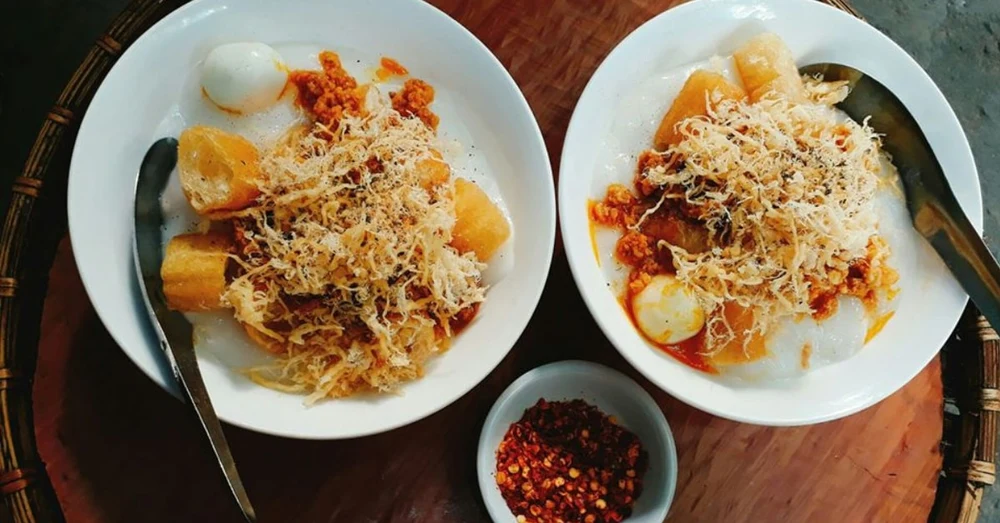

- **Kem bơ `(avocado ice cream)`**
> 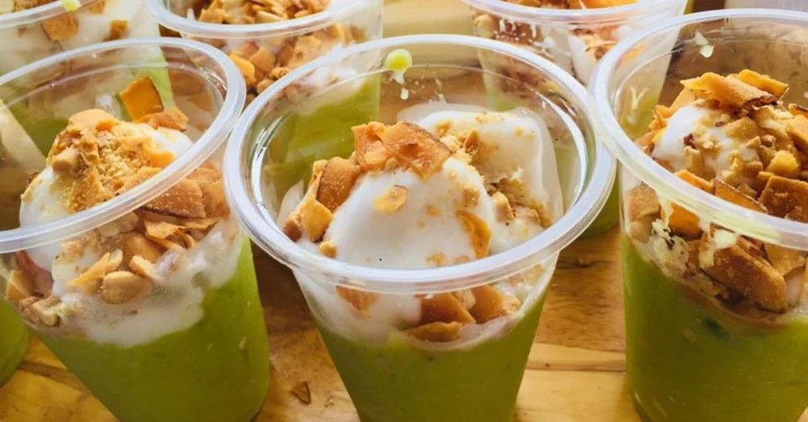

- **Chè sầu riêng `(durian sweet soup)`**
> 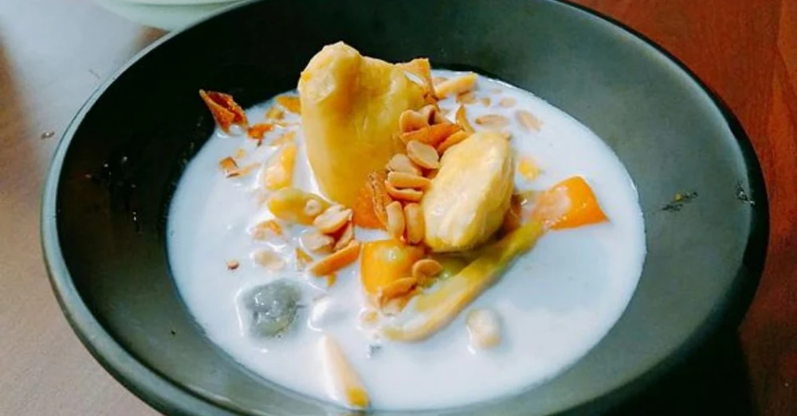

### Places:
- **Bà Nà Hills `(Ba Na Hills)`**
> 

- **Thánh địa Mỹ Sơn `(My Son Sanctuary)`**
> 

- **Ngũ Hành Sơn `(Marble Mountains)`**
> 

- **Cầu rồng `(The Dragon bridge)`**
> 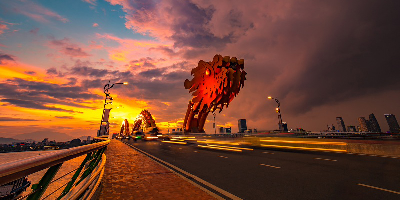

- **Đèo Hải Vân `(Hai Van Pass)`**
> 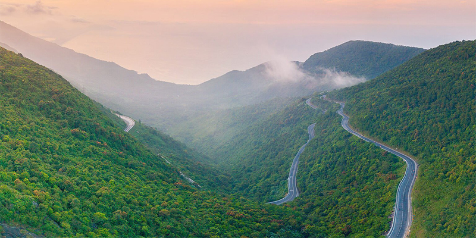

- **Làng cổ Phong Nam `(Phong Nam ancient village)`**
> 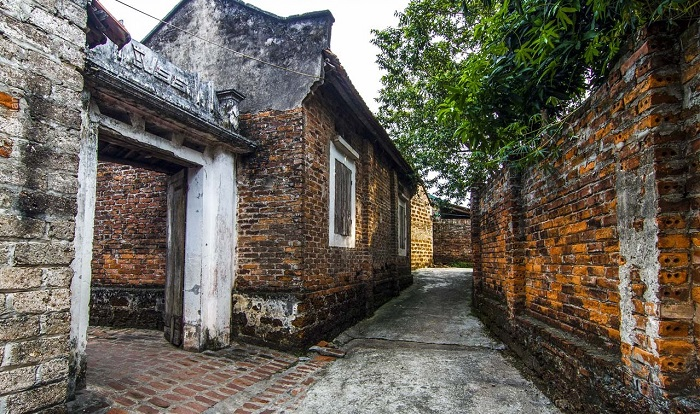

- **Cầu sông Hàn `(Han river bridge)`**
> 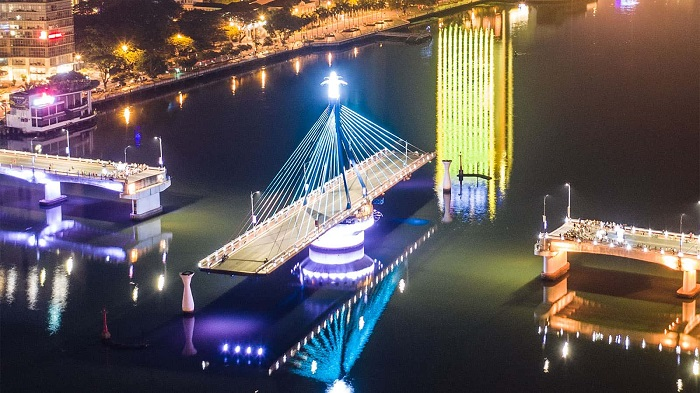

- **Cầu khoá tình yêu `(love lock bridge)`**
> 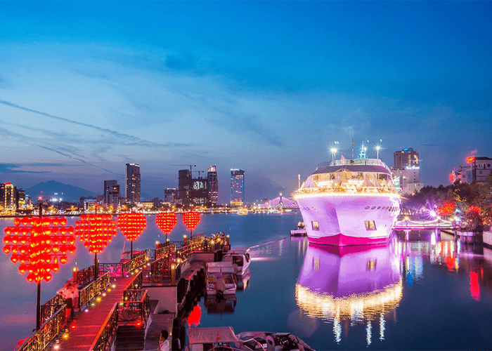

- **Đỉnh bàn cờ `(Ban Co peak)`**
> 

- **Chùa Linh Ứng `(Linh Ung pagoda)`**
> 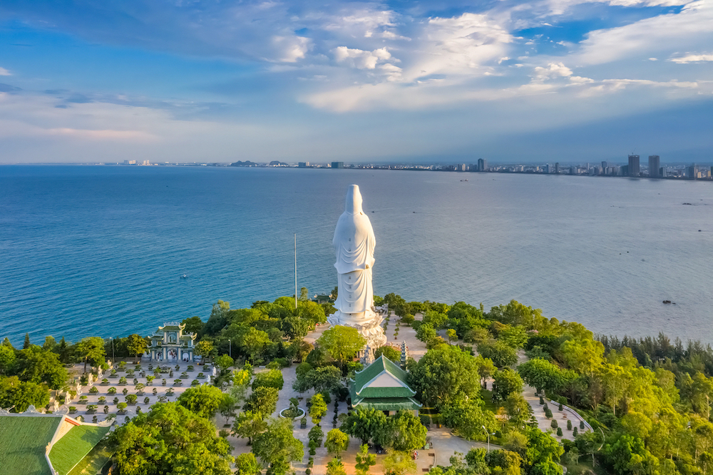
