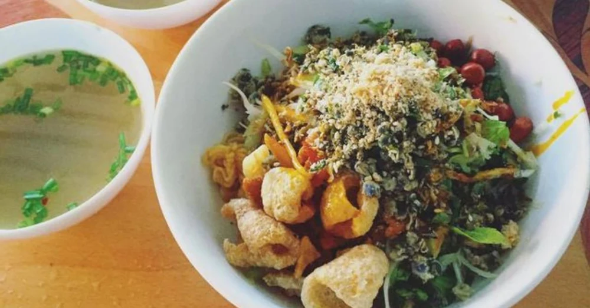
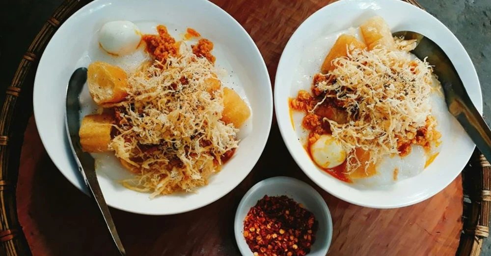
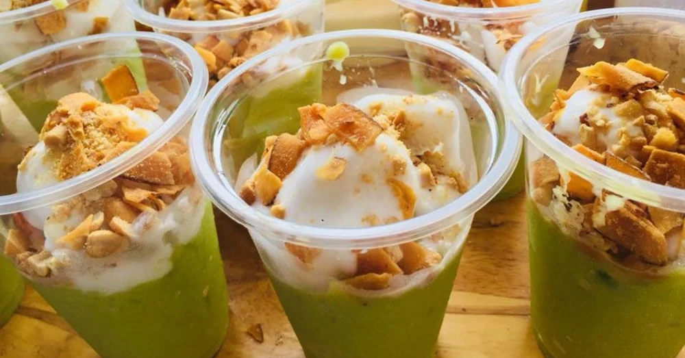
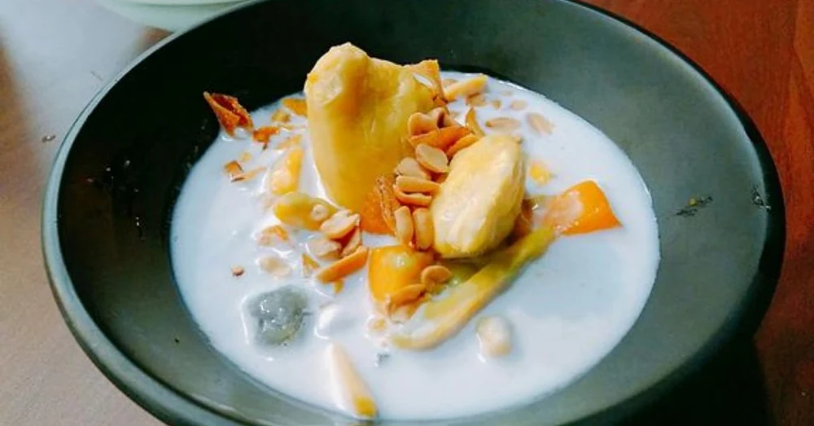
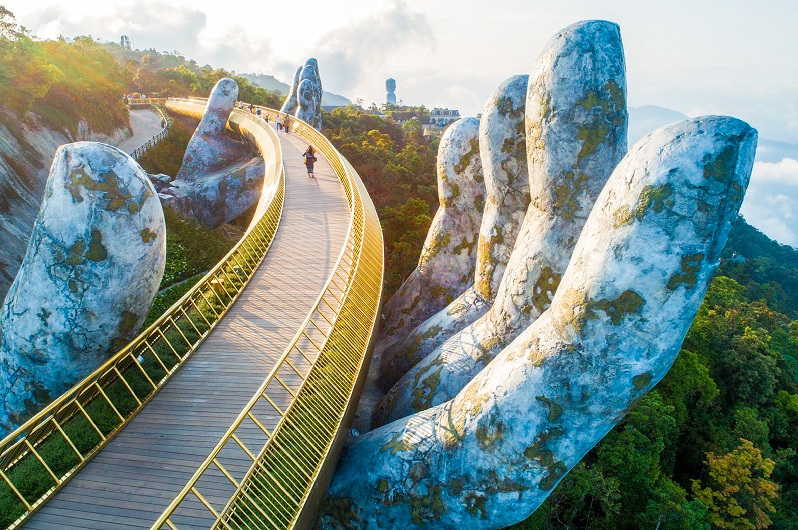
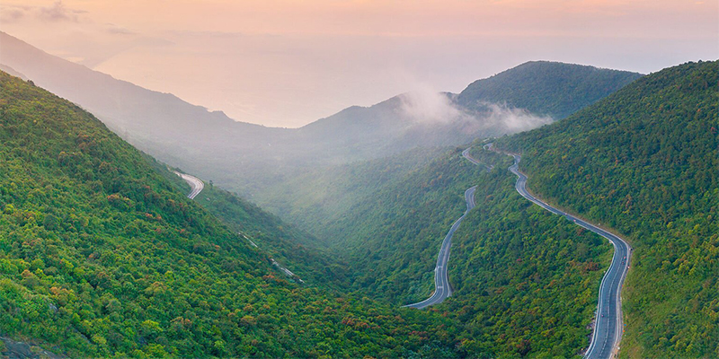
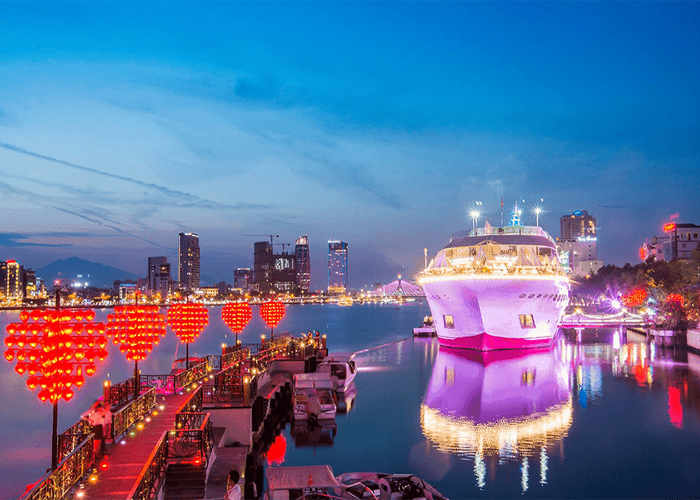

## [DaNang]

### Foods:
- **`Some outstanding foods`**

	|||
	| ---- | ----------------- |
	|**Bánh tráng kẹp /bun trang kehp/ `(rice paper sandwich)`**||
	|**Bánh nậm /bun nam/ `(flat steamed rice dumplings)`**||
	|**Bánh bột lọc /bun bot lohk/ `(rice dumplings cake)`**||
	|**Bánh căn /bun cahn/ `(Vietnamese mini pancake)`**||
	|**Bánh đập /bun dap/ `(crushed rice cracker)`**||
	|**[Bún mắm nêm /boon mam nem/](./foods/danang/bunmamnem.md) `(rice vermicelli with smelly fish sauce)`**||
	|**Bún chả cá /boon cha ka/ `(fish cake noodle)`**||
	|**Bún hải sản /boon hai san/ `(seafood noodle)`**||
	|**Cơm hến /gum hen/ `(baby basket clams rice)`**||
	|**Nem tré /nem treh/ `(fried fermented pork roll)`**||
	|**Phá lấu /fah low/ `(organ meat)`**||
	|**Ram cuốn lá cải /ram kwoon lah kai/ `(fried spring roll in cabbage)`**||
	|**Cháo quẩy sườn sụn /chow kwai soong soon/ `(rice porridge with deep-fried dough sticks and pork ribs)`**||

### Drinks:
- **`Some outstanding drinks`**

	|||
	| ---- | ----------------- |
	|**Kem bơ /kem bo/ `(avocado ice cream)`**||
	|**Chè sầu riêng /cheh sow ree-eng/ `(durian sweet soup)`**||

### Places:
- **`most wanted places`**

	|||
	| ---- | ----------------- |
	|**Bà Nà Hills `(Ba Na Hills)`**||
	|**Thánh địa Mỹ Sơn `(My Son Sanctuary)`**||
	|**Ngũ Hành Sơn `(Marble Mountains)`**||
	|**Cầu rồng `(The Dragon bridge)`**||
	|**Đèo Hải Vân `(Hai Van Pass)`**||
	|**Làng cổ Phong Nam `(Phong Nam ancient village)`**||
	|**Cầu sông Hàn `(Han river bridge)`**||
	|**Cầu khoá tình yêu `(love lock bridge)`**||
	|**Đỉnh bàn cờ `(Ban Co peak)`**||
	|**Chùa Linh Ứng `(Linh Ung pagoda)`**||
