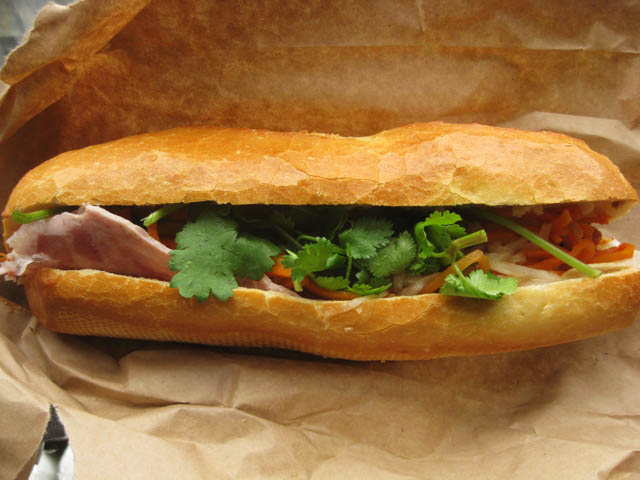
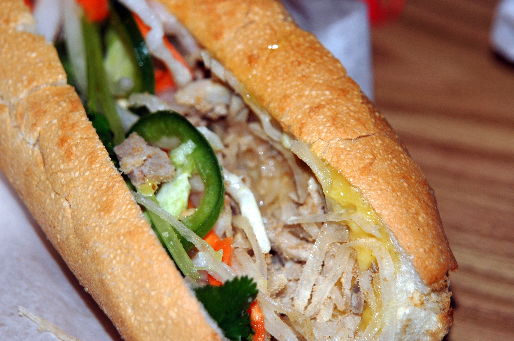
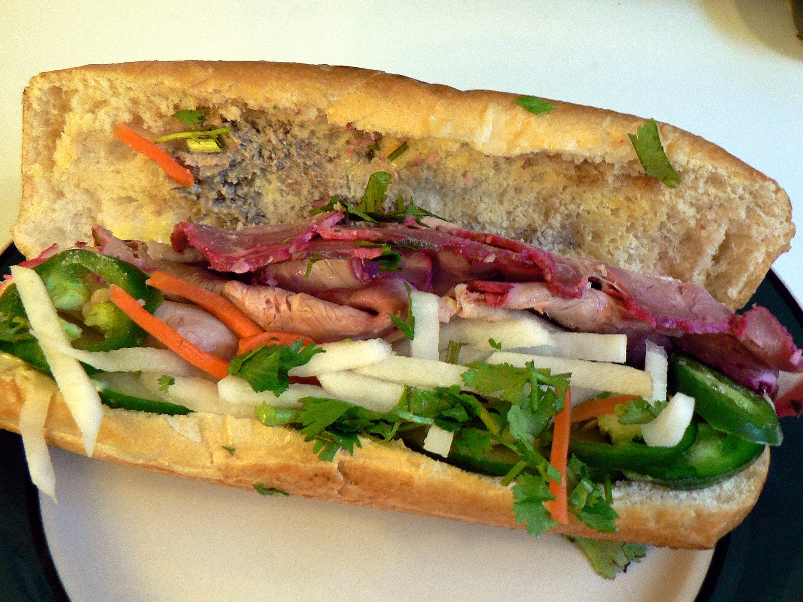
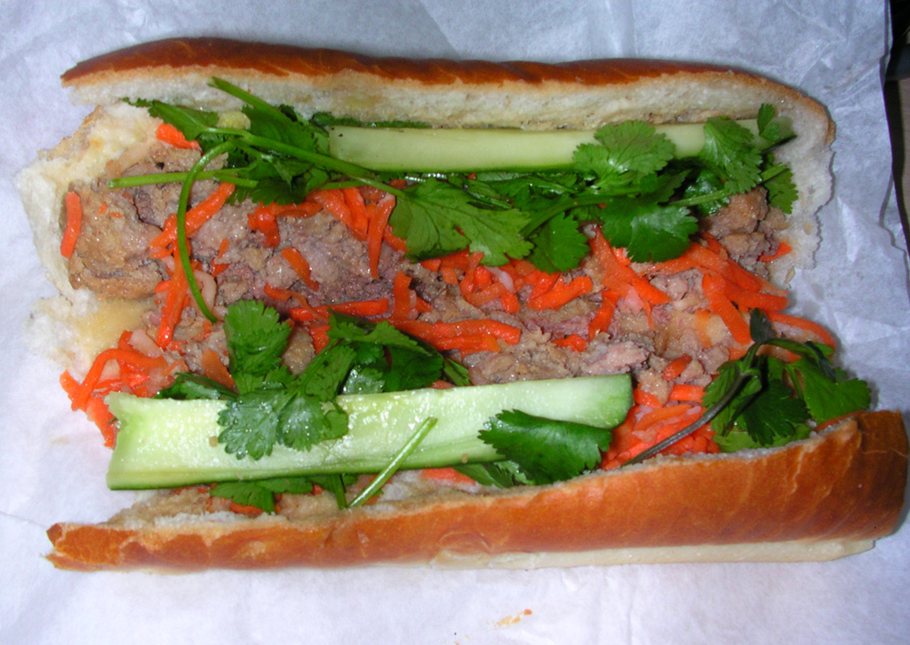
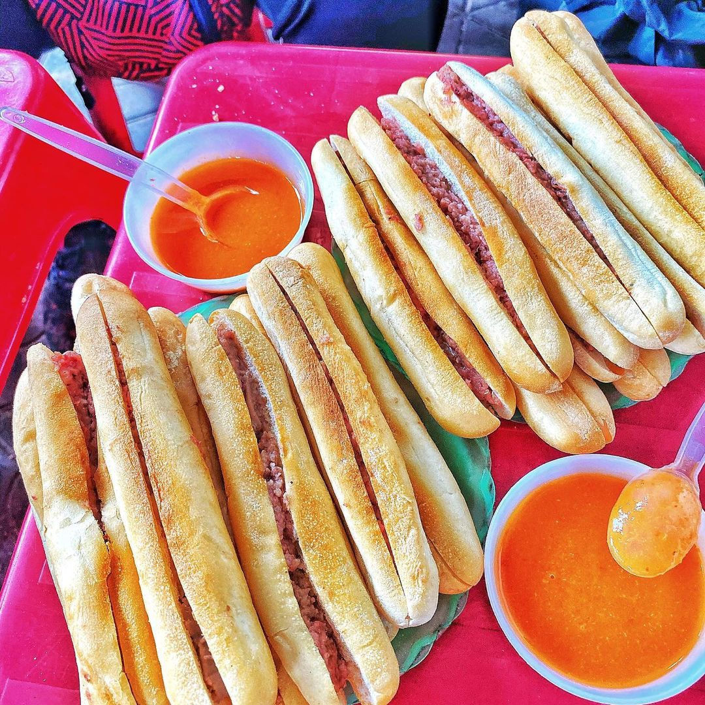
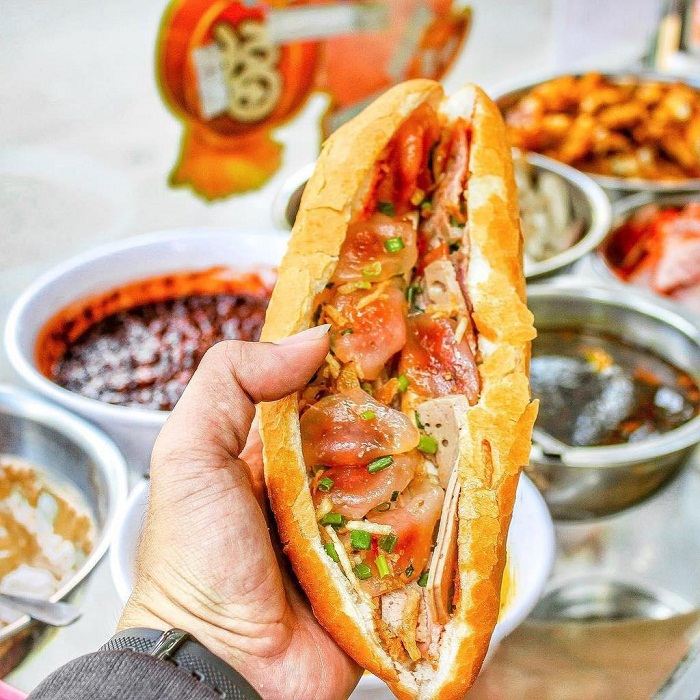
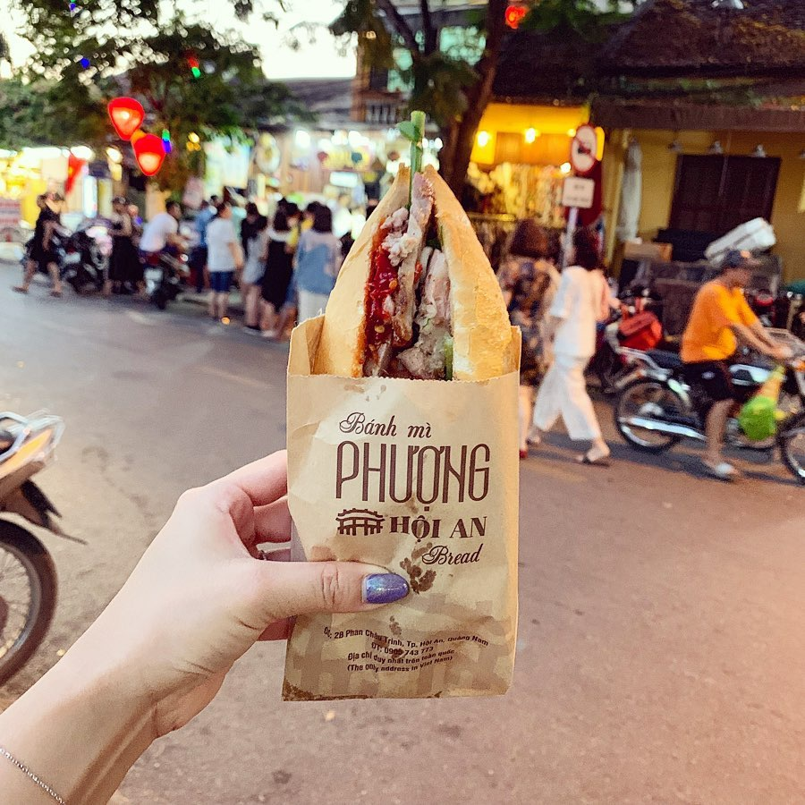

# [Bánh mì `(bread)`]

## Introduction
> Vietnamese baguette, or banh mi, originated from the baguette brought to Southern Vietnam by the French in the 20th century. Some researchers believe that this dish had been present in Vietnam for 150 years. In the following decades, banh mi spread throughout Central and Southern Vietnam, especially in Saigon.

## Ingredient

## Food gallery

  

    
    
    
    
    
    
    
    
  

  <a class="prev" onclick="plusSlides(-1)">&#10094;</a>
  <a class="next" onclick="plusSlides(1)">&#10095;</a>

## Recommended places

 - Bánh mì Phượng
<figure class="map-container">
  <iframe src="https://www.google.com/maps/embed?pb=!1m18!1m12!1m3!1d3837.5827733488!2d108.3293479752058!3d15.878511244515282!2m3!1f0!2f0!3f0!3m2!1i1024!2i768!4f13.1!3m3!1m2!1s0x31420dd587dbb975%3A0xd214dd792e0869d7!2zQsOhbmggTWnMgCBQaMaw4bujbmc!5e0!3m2!1sen!2s!4v1687627500300!5m2!1sen!2s" width="600" height="450" style="border:0;" allowfullscreen="" loading="lazy" referrerpolicy="no-referrer-when-downgrade"></iframe>
</figure>

 - Bánh mì Madam Khanh
<figure class="map-container">
	<iframe src="https://www.google.com/maps/embed?pb=!1m18!1m12!1m3!1d3837.5424754189453!2d108.3253605752057!3d15.880626244459174!2m3!1f0!2f0!3f0!3m2!1i1024!2i768!4f13.1!3m3!1m2!1s0x31420e7943de2173%3A0x4296bf40af5321a7!2sMadam%20Khanh%20-%20The%20Banh%20Mi%20Queen!5e0!3m2!1sen!2s!4v1687628033953!5m2!1sen!2s" width="600" height="450" style="border:0;" allowfullscreen="" loading="lazy" referrerpolicy="no-referrer-when-downgrade"></iframe>
</figure>

 - Banh Mi Sum
<figure class="map-container">
  <iframe src="https://www.google.com/maps/embed?pb=!1m18!1m12!1m3!1d3837.5594735900363!2d108.32162247518406!3d15.879734144482901!2m3!1f0!2f0!3f0!3m2!1i1024!2i768!4f13.1!3m3!1m2!1s0x31420e7c79a839e5%3A0x246d3ac41dde4a56!2sBanh%20Mi%20Sum!5e0!3m2!1sen!2s!4v1688192467323!5m2!1sen!2s" width="600" height="450" style="border:0;" allowfullscreen="" loading="lazy" referrerpolicy="no-referrer-when-downgrade"></iframe>
</figure>

- Bánh mì Lành
<figure class="map-container">
  <iframe src="https://www.google.com/maps/embed?pb=!1m18!1m12!1m3!1d3837.5810129243623!2d108.329157975184!3d15.878603644512818!2m3!1f0!2f0!3f0!3m2!1i1024!2i768!4f13.1!3m3!1m2!1s0x31420fabb76c5089%3A0x5cb44d5942440637!2zQsOhbmggbcOsIEzDoG5o!5e0!3m2!1sen!2s!4v1688192502295!5m2!1sen!2s" width="600" height="450" style="border:0;" allowfullscreen="" loading="lazy" referrerpolicy="no-referrer-when-downgrade"></iframe>
</figure>

## Opening hours

## Price

## Reviews
