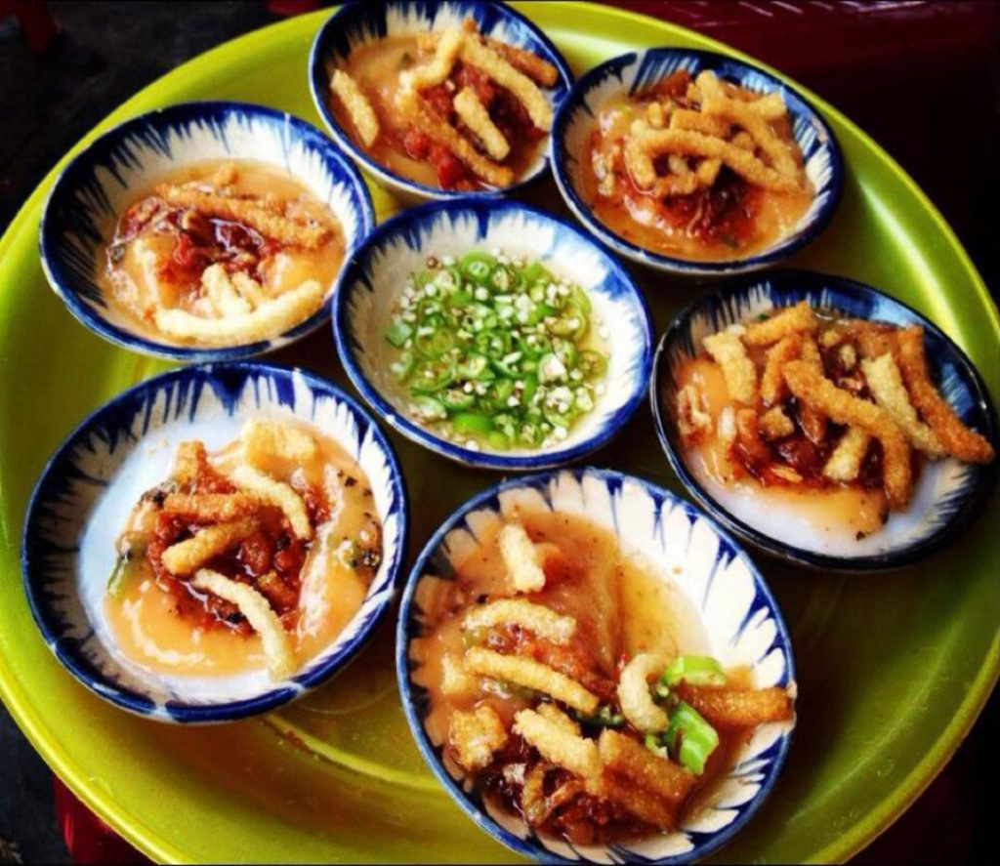
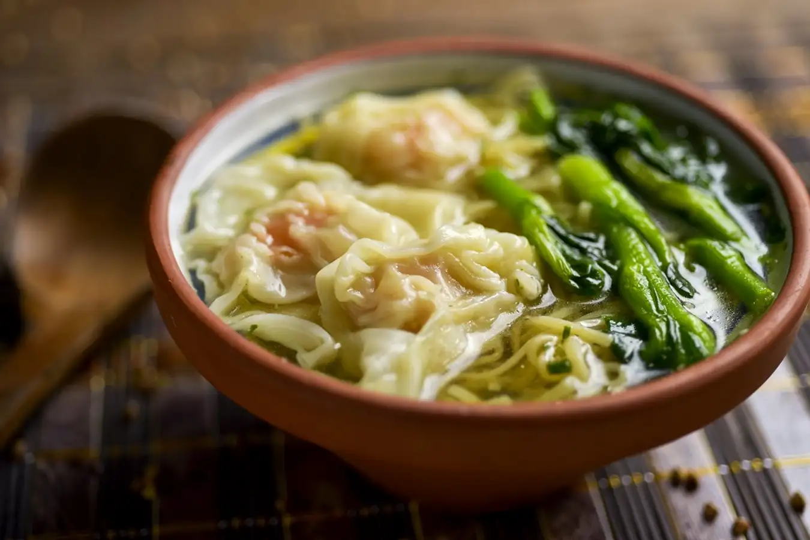
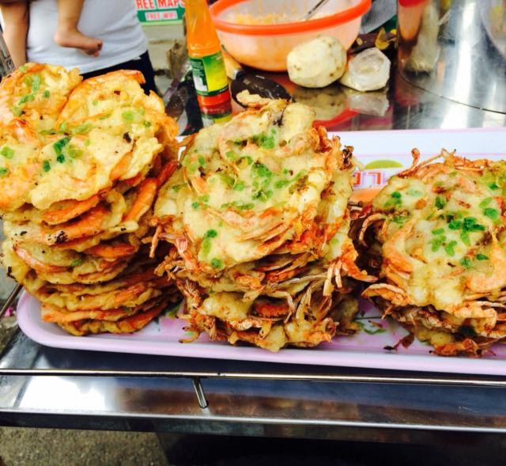
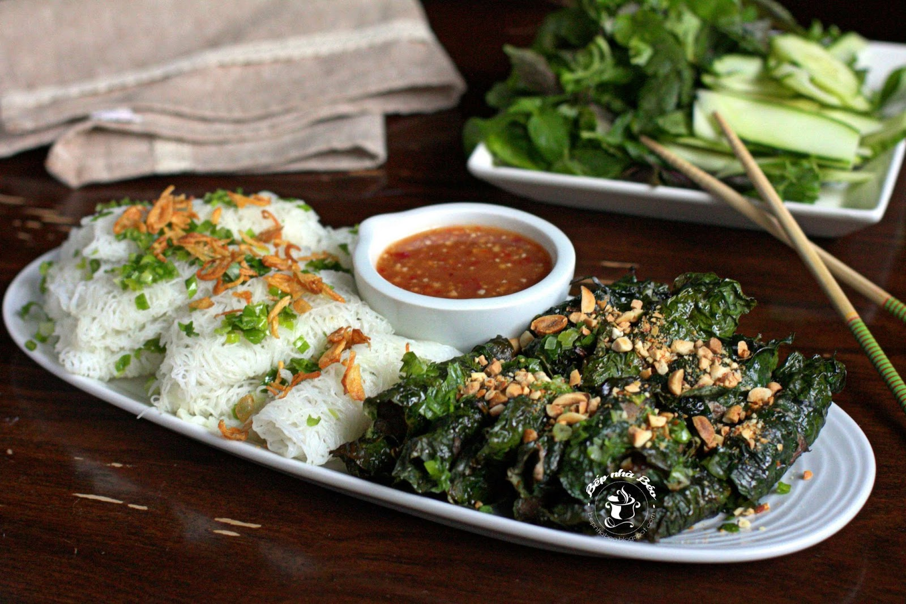
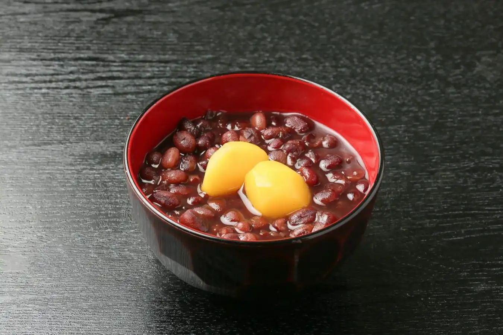
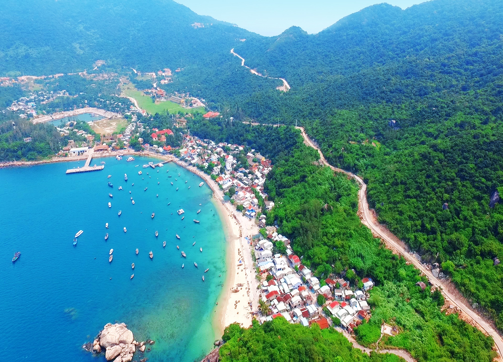
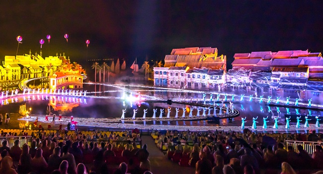

## [HoiAn]

### Foods:
- **`MUST TRY`**

	|||
	| ---- | ----------------- |
	|**[Bánh mì /bun mee/](./foods/hoian/banhmi.md) `(bread)`**||
	|**[Cơm gà /gum gah/](./foods/hoian/comga.md) `(chicken rice)`**||
	|**[Cao lầu /cow low/](./foods/hoian/caolau.md) `(a pork noodle dish)`**||
	|**[Bánh hoa hồng trắng /bun hwa hawng trang/](./foods/hoian/banhhoahongtrang.md) `(white rose)`**||
	|**[Bánh bèo /bun bey-oh/](./foods/hoian/banhbeochen.md) `(cup cake)`**||
	|**[Bánh ướt thịt nướng /bun uwt teet noong/](./foods/hoian/banhuotthitnuong.md) `(steamed thin rice pancake and grilled pork)`**||
	|**[Bún thịt nướng /boon teet noong/](./foods/hoian/bunthitnuong.md) `(grilled pork on skewers with noodles)`**||
	|**[Bánh xèo /bun say-oh/](./foods/hoian/banhxeo.md) `(sizzling pancake)`**||
	|**[Mì hoành thánh (vằn thắn) /mee hwan tahn/](./foods/hoian/mihoanhthanh.md) `(wonton soup)`**||
	|**[Bánh tôm /bun tom/](./foods/hoian/banhtom.md) `(shrimp in batter)`**||
	|**[Bánh ghẹ /bun ghe/](./foods/hoian/banhghe.md) `(fried crab cake)`**||
	|**[Bò Nướng Lá Lót /boh noo-uhng lah loht/]() `(grilled beef wrapped in betel leaf)`**||
	|**[Xiên Nướng /see-en noo-uhng/]() `(grilled skewers)`**||
	|**[Bánh Đập /bun dap/](./foods/hoian/banhdap.md) `(crushed rice cracker)`**||
	|**[Hến Trộn /hen trawn/](./foods/hoian/hentron.md) `(stir-fried baby clams mixed with various vegetables, herbs, and spices)`**||
	|**[Cà ri bò kho /ka-ree boh khaw/](./foods/hoian/caribokho.md) `(curry beef stew)`**||
	|**[Mì Quảng /mee kwang/](./foods/hoian/miquang.md) `(Quang noddle)`**||

### Drinks:
- **`MUST DRINK`**

	|||
	| ---- | ----------------- |
	|**[Nước Mót /noo-uhk moht/](./foods/hoian/nuocmot.md) `(Mot’s traditional herbal drink)`**||
	|**[Chè đậu đỏ /cheh dow doh/](./foods/hoian/chedaudo.md) `(red bean sweet soup)`**||
	|**[Chè bắp /cheh bup/](./foods/hoian/chebap.md) `(sweet corn porridge)`**||
	|**[Chí mà phù (chè mè đen) /cheh meh den/](./foods/hoian/chimaphu.md) `(black sesame sweet soup)`**||
	|**[Tào phớ /tao fuh/](./foods/hoian/taopho.md) `(tofu pudding)`**||

### Places:
- **`Khu phố cổ (old town)`**

	|||
	| ---- | ----------------- |
	| **Chùa Cầu `(Cau pagoda)`** ||
	| **Chùa Phúc Kiến `(Phuc Kien pagoda)`** ||
	| **Chợ Hội An `(Hoi An market)`** ||
	|**Chợ đêm `(Night market)`**||
	|**Các khu di tích `(monuments)`**||

- **`MUST GO`**

	|||
	| ---- | ----------------- |
	|**[Làng gốm Thanh Hà](./places/hoian/langgomthanhha.md) `(Thanh Ha pottery village)`**||
	|**[Làng rau Trà Quế](./places/hoian/langrautraque.md) `(Tra Que vegetable village)`**||
	|**[Rừng dừa Bảy Mẫu](./places/hoian/rungduabaymau.md) `(Bay Mau coconut forest)`**||
	|**[Biển An Bàng](./places/hoian/bienanbang.md) `(An Bang beach)`**||
	|**[Biển Cửa Đại](./places/hoian/biencuadai.md) `(Cua Dai beach)`**| |
	|**[Cù lao Chàm](./places/hoian/culaocham.md) `(Cham islands)`**||
	|**[Vinpearl](./places/hoian/vinpearl.md)**||
	|**[Show ký ức Hội An](./places/hoian/hoianmemory.md) `(Hoi An memories)`**||
